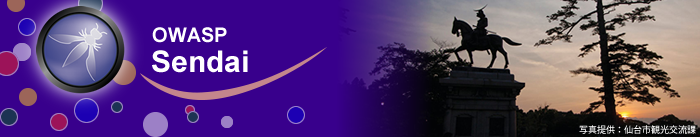

---
# OWASP Sendaiへようこそ
---
<br>

---
# <span style="color: red; ">Featured</span>

## [OWASP Chapters ALL Day](https://owasp.org/www-community/social/chapters_all_day/)

### OWASP Chapters All Day June 6-7 - 12:00 noon (UTC) Saturday - 12:00 noon (UTC) Sunday

### Organising Committee
* Oscar Bravo Lara (United Kingdom)
* Oscar Carlo Orellana Artigas (Chile)
* John DiLeo - Chapter Leader (New Zealand)
* ***Takaharu Ogasa - Chapter Leader (Sendai, Japan)***
* Grant Ongers - Global Board of Directors (United Kingdom)
* Vandana Verma Sehgal - Global Board of Directors (India)

---

# OWASP Sendaiとは
アメリカメリーランド州を本部とするOWASP Foundationの ***仙台支部*** です。

### **OWASP** - Open Web Application Security Project<br>
Webアプリケーションセキュリティに関する情報や文書、知識の共有、普及を目的としたオープンで非営利の
オープンソース・ソフトウェアコミュニティです。
<br>

# OWASP Sendaiミーティング
仙台のWEBセキュリティ向上に貢献しようという地元有志が集まって開くWEBセキュリティの勉強会です。セキュリティに係る幅広い分野のスピーカーのみなさんをお呼びして開催します。職種、経験、性別、年齢、国籍問わずどなたでもご参加ください。
<br>

イベント開催等の情報はメーリングリストやSNSにて配信しております。
### [Facebook](https://www.facebook.com/owaspsendai/)
### [Twitter](https://twitter.com/OWASP_Sendai)
###
### [~~NIKKA~~](https://www.nikka.com/guide/miyagikyo/about.html)

# スピーカーとして参加をご希望の方へ

OWASP Sendaiミーティングに、スピーカーとして参加をご希望の方は、 [speaker agreement](https://owasp.org/www-policy/legal/speaker-agreement)をご覧いただき、チャプターリーダーにプレゼンテーションしたいトピックをお知らせ下さい。
<br>

# チャプタースポンサー

寄付によりOWASP Sendaiチャプターの活動に貢献していただいているスポンサー様の一覧です。

## ゴールドチャプタースポンサー

| [](https://security-initiative.co.jp) |

<br>

# 次回のミーティング

## OWASP Sendai ミーティング 42
   * 2020年5月12日(火) 19:00～21:00 (終了時間は前後します) オンライン開催
   * トークタイトル
      * 「API Security Top10 Overview」 山本誠樹 (@nnasaki) / Microsoft MVP for Microsoft Azure
      * 「OSINT at The Services for Corparate」 Oscar Orellana (@odin_200)  / OWASP Chile Chapter
   * 参加お申し込み
      * [Connpassのお申し込みページへ](https://owaspsendai.connpass.com/event/175125/)


<!-- Standard Chapter Page Template
This is an example of a Project or Chapter page.
Please change these items to indicate the actual information you wish to present. In addition to this information, the 'front-matter' above the text should be modified to reflect your actual information.  An explanation of each of the front-matter items is below:

{front matter for this file}

```
- layout: This is the layout used by project and chapter pages.  You should leave this value as col-sidebar
- title: This is the title of your project or chapter page, usually the name.  For example, OWASP Zed Attack Proxy or OWASP Baltimore
- tags: This is a space-delimited list of tags you associate with your project or chapter.  If you are using tabs, at least one of these tags should be unique in order to be used in the tabs files (an example tab is included in this repo)
- region: This is the region you are in according to our data
```

{copy for this file (index.md)}
Replace the text above the commented area with your information in the format below:
```
## Welcome
Include some information here about your chapter

## Participation
The Open Web Application Security Project (OWASP) is a nonprofit foundation that works to improve the security of software. All of our projects ,tools, documents, forums, and chapters are free and open to anyone interested in improving application security.

Chapters are led by local leaders in accordance with the [Chapter Leader Handbook](/www-policy/rules-of-procedure/chapter-handbook). Financial contributions should only be made online using the authorized online donation button. To be a SPEAKER at ANY OWASP Chapter in the world simply review the [speaker agreement](/www-policy/speaker-agreement) and then contact the local chapter leader with details of what OWASP Project, independent research, or related software security topic you would like to present.

Everyone is welcome and encouraged to participate in our [Projects](/projects), [Local Chapters](/chapters), [Events](/events), [Online Groups](https://groups.google.com/a/owasp.com/){:target='_blank'}, and [Community Slack Channel](https://owasp.slack.com/){:target='_blank'}. We especially encourage diversity in all our initiatives. OWASP is a fantastic place to learn about application security, to network, and even to build your reputation as an expert. We also encourage you to be [become a member](/membership) or consider a [donation](/donate) to support our ongoing work.

## Local News
- Meeting Location
- Everyone is welcome to join us at our chapter meetings.

```
{info.md}

This separate file is where you should place links to your Google Group and Meetup page. It will be automatically rendered in the column sidebar.

{leaders.md}

Another separate file that should simply include each leaders name with mailto link as a list. It will also be automatically rendered in the column sidebar.

-->
