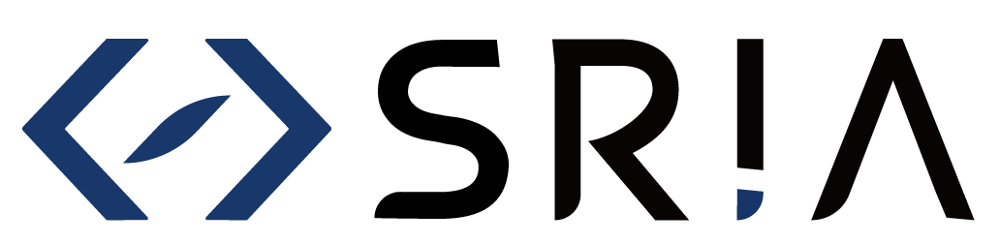
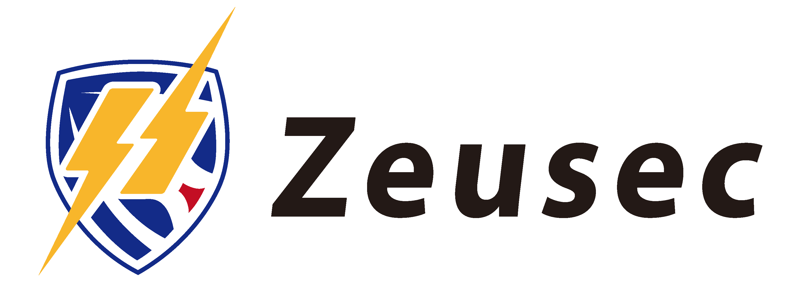
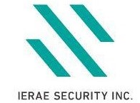

# OWASP Sendai Day 2020
OWASP Sendai発足4周年とローカルチャプターミーティング通算40回を記念して、過去にOWASP Sendaiでトークしていただいたみなさまをキーノートスピーカーズとして多数お招きし、CFPによる新たなスピーカーのみなさまの登壇により知見の交換/交流を行うことを目的とした2日間のネットワーキングイベントです。

### ゴールドスポンサー

|  |
 

### ブロンズスポンサー

|  |  |
|  | [株式会社RAPiC](http://rapic.jp/) |
 

### スピーカースポンサー
スピーカーの皆様の当イベント参加のために貴重なリソース支援していただいた企業様です。

|  |  |  |
|  |  | [株式会社RAPiC](http://rapic.jp/) |
 

### キーノートスピーカーのみなさま(50音順)
Soya Aoyama (@SoyaAoyama) / 富士通システム統合研究所

小田 保之 (@yas55224740) / 個人

酒井 正夫 / 東北大学 データ駆動科学・AI教育研究センター

佐藤 陽亮 / 株式会社ハイテックシステム

高橋そのみ / 株式会社RAPiC

千葉 翔也 /東北工業大学

羽鶴 颯 (@kawada_syogo225) / 株式会社セキュアスカイ・テクノロジー

松本 悦宜改め松本 イルカ (@ym405nm) / Capy株式会社

三村 聡志 (@mimura1133) / 株式会社イエラエセキュリティ

### 招待スピーカーのみなさま(50音順)
安里 悠矢(@328__) / 株式会社イエラエセキュリティ

伊藤彰嗣 (@springmoon6)

喜屋武 慶大(@uranariz)

佐藤一宏 / 株式会社エクテック

園田 道夫 (@sonodam) / 情報通信研究機構 ナショナルサイバートレーニングセンター

田端 政弘 (@delphinz) / MINI Hardening運営リーダー

桃原 裕太 / 株式会社シーエー・アドバンス

保要 隆明 (@takahoyo) / 株式会社エヌ・エフ・ラボラトリーズ

松宮大輝

mage (@mage_1868) / 株式会社イエラエセキュリティ

渡辺 慎太郎 / 株式会社ジュピターテレコム

### トーク内容＆スケジュール
#### 2月8日(土)午前
* 「The MITM Attack Against Password Manager」Soya Aoyama (@SoyaAoyama) / 富士通システム統合研究所
* 「ICTスキルとコミュニティで女性の人生を自由に！」高橋そのみ / 株式会社RAPiC
* 「Docker 危険のキ！」小田 保之 (@yas55224740) / 個人
* 「悪の人工知能」園田 道夫 (@sonodam) / 情報通信研究機構 ナショナルサイバートレーニングセンター

#### 2月8日(土)午後
* 「Deep Dive into Masakari」千葉 翔也 /東北工業大学
* 「OWASP SAMM v2 Introduction」伊藤彰嗣 (@springmoon6)
* 「Bluetooth経由の攻撃（実演デモ）」佐藤 陽亮 / 株式会社ハイテックシステム
* 「A New Era of CSS Injection」mage (@mage_1868) / 株式会社イエラエセキュリティ
* 「GAFAに負けないDX時代のビッグデータAI活用でシンギュラリティの人材不足を5Gによりイノベーションでpayする2020」松本 悦宜改め松本 イルカ (@ym405nm) / Capy株式会社

#### 2月9日(日)午前
* 「Oneday: App Crash Investigation」三村 聡志 (@mimura1133) / 株式会社イエラエセキュリティ
* 「ケーブル屋は見た！」渡辺 慎太郎 / 株式会社ジュピターテレコム
* 「脆弱性診断員の育成について」桃原 裕太 / 株式会社シーエー・アドバンス
* 「Mini Hardening演習環境構築」田端 政弘 (@delphinz) / MINI Hardening運営リーダー
* 「脆弱性診断員の2年を振り返ってみて」安里 悠矢(@328__) / 株式会社イエラエセキュリティ

#### 2月9日(日)午後
* 「SameSite Cookie と CSRF」喜屋武 慶大 (@uranariz)
* 「Hardening 2020 BOに参加してきた」保要 隆明 (@takahoyo) / 株式会社エヌ・エフ・ラボラトリーズ
* 「コインハイブ事件から読み取る護身術と民法改正におけるIT業界への影響」松宮大輝
* 「個人情報保護から見るデータのあり方」佐藤一宏 / 株式会社エクテック
* 「ブロックチェーン技術の社会実装の取り組み事例」酒井 正夫 / 東北大学 データ駆動科学・AI教育研究センター
* 「WAFの色々」羽鶴 颯 (@kawada_syogo225) / 株式会社セキュアスカイ・テクノロジー

### 【OWASP Sendaiとは】
Webアプリケーションセキュリティに関する情報や文書、知識の共有、普及を目的としたオープンで非営利な組織であるアメリカメリーランド州を本部とするOWASP Foundationの仙台支部です。

### 【OWASP Sendai ミーティング】
OWASP Sendaiミーティングは仙台のWEBセキュリティ向上に貢献しようという地元有志が集まって開くWEBセキュリティの勉強会です。セキュリティに係る幅広い分野のスピーカーのみなさんをお呼びして開催します。職種、経験、性別、年齢、国籍問わずどなたでもご参加ください。

- OWASP Sendai チャプターページ https://www.owasp.org/index.php/Sendai
- OWASP Sendai Facebookページ https://www.facebook.com/owaspsendai/
- OWASP Sendai Twitter https://twitter.com/OWASP_Sendai

